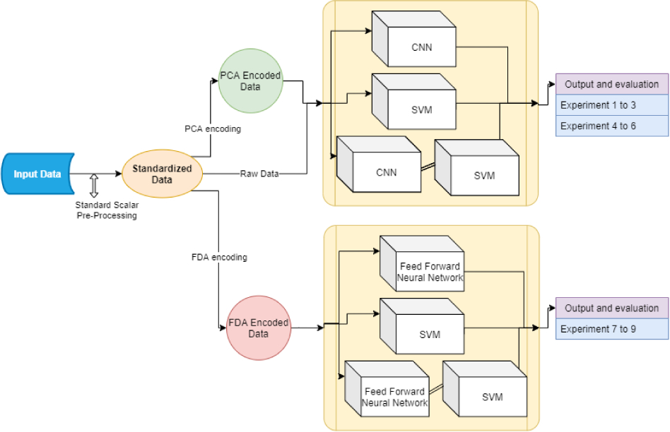

# Searching Efficient Models for Human Activity Recognition

Human Activity Recognition (HAR) can be measured in various ways in a new era of growing technologies. This paper studies different classification and data processing tasks. This paper proposes using HAR to monitor the elderly while being power-efficient and respecting an individual's privacy, allowing it to be run on mobile devices like smartphones or smartwatches. Upon reviewing other methods of HAR by sensor data, we realized that they severely lacked in the areas mentioned earlier. Moreover, they either used older classification techniques or made too complex and over-the-top models for the same. We tested a total of nine methods to find the best model/method, from simple support vector machines (SVM) and convolutional neural networks (CNN) to hybrid models. The best results were produced by a simple, fully connected network (multi-layer perceptron) with the data condensed using Fisher's linear discriminant analysis (FLDA) that gave us 98.6% accuracy. Our final model satisfies both the requirements we had set; it is simplified and produces benchmark results.

## Dataset Used
The following dataset was used for this study:

Davide Anguita, Alessandro Ghio, Luca Oneto, Xavier Parra, and Jorge Luis Reyes-Ortiz. 2013. A public domain dataset for human activity recognition using smartphones.

The dataset can be found on [UCI ML repository](https://archive.ics.uci.edu/ml/datasets/human+activity+recognition+using+smartphones).


## Experiment architecture



We conducted 9 experiments, each with a different model and different data processing techniques. We trie different combinations of raw data, PCA encoded data and FLDA encoded data with SVM, CNNs, fully connected network, hybrid models (CNN + SVM or fully connected network + SVM). We also tried different hyperparameters for the models. The results of each model and its combination is shown in the table below.

## Results

| Model                           | Precision | Recall   | F1-score | Accuracy  |
| ------------------------------- | --------- | -------- | -------- | --------- |
| HAR-Multi-SVM [1]               | 0.9       | 0.89     | 0.89     | 0.893     |
| HAR-SVM(2016) [2]               | -         | -        | -        | 0.895     |
| HAR-ConvNet(2016) [3]           | 0.94      | 0.94     | -        | 0.937     |
|                                 |           |          |          |           |
| CNN Raw Data (Exp.1)            | 0.97      | 0.96     | 0.96     | 0.964     |
| SVM Raw Data (Exp.2)            | 0.97      | 0.96     | 0.96     | 0.97      |
| CNN + SVM Raw Data (Exp.3)      | 0.97      | 0.97     | 0.97     | 0.966     |
| CNN PCA data (Exp.4)            | 0.92      | 0.92     | 0.92     | 0.923     |
| SVM PCA data (Exp.5)            | 0.94      | 0.94     | 0.94     | 0.94      |
| CNN + SVM PCA data (Exp.6)      | 0.93      | 0.93     | 0.93     | 0.926     |
| **MLP FLDA data (Exp.7)**       | **0.99**  | **0.99** | **0.99** | **0.986** |
| SVM FLDA data (Exp.8)           | 0.94      | 0.94     | 0.94     | 0.94      |
| **MLP + SVM FLDA data (Exp.9)** | **0.98**  | **0.98** | **0.98** | **0.98**  |

The most performant model is the MLP on FLDA data achieving an accuracy of 98.6%.

## Publications

We presented our experiments in International Conference on Biomedical Imaging, Signal Processing (ICBSP) 2021 and after peer reviews our paper was published in [the ACM journal for the conference](https://doi.org/10.1145/3502803).

Our paper can be specifically found at [this link](https://doi.org/10.1145/3502803.3502809).

To cite our paper, please use the following citation:

```bibtex
@inproceedings{10.1145/3502803.3502809,
author = {Kaspour, Shamisa and Raj, Nikhil and Mishra, Alankrit and Yassine, Abdulsalam and Eustaquio Alves De Oliveira, Thiago},
title = {Searching Efficient Models for Human Activity Recognition},
year = {2021},
isbn = {9781450385817},
publisher = {Association for Computing Machinery},
address = {New York, NY, USA},
url = {https://doi.org/10.1145/3502803.3502809},
doi = {10.1145/3502803.3502809},
booktitle = {2021 6th International Conference on Biomedical Imaging, Signal Processing},
pages = {40–45},
numpages = {6},
keywords = {Linear Discriminant Analysis, Pattern Recognition, Smartphone Sensor Data, Human Activity Recognition},
location = {Xiamen, China},
series = {ICBSP '21}
}
```

## References

> Note: The papers below are may have different reference indexes that the ones cited in our paper.
  
1. Davide Anguita, Alessandro Ghio, Luca Oneto, Xavier Parra, and Jorge L Reyes-Ortiz. 2012. Human activity recognition on smartphones using a multiclass hardware-friendly support vector machine. In International workshop on ambient assisted living. Springer, 216–223.
2. D. N. Tran and D. D. Phan. 2016. Human Activities Recognition in Android Smartphone Using Support Vector Machine. In 2016 7th International Conference on Intelligent Systems, Modelling and Simulation (ISMS). 64–68. https://doi.org/10.1109/ISMS.2016.51
3. Charissa Ann Ronao and Sung-Bae Cho. 2016. Human activity recognition with smartphone sensors using deep learning neural networks. Expert systems with applications 59 (2016), 235–244.
